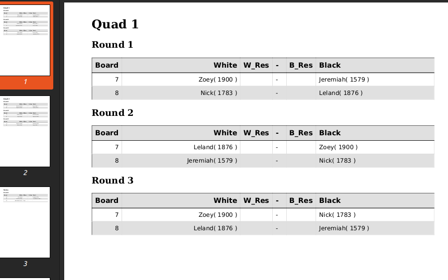
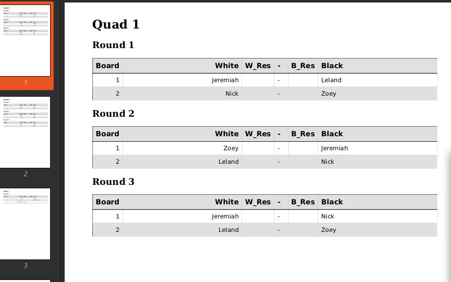

# Quad Pairing Generator

This is a quick python script for generating quad pairing sheets, particular made for chess but any quad tournament could use this program. The program essentially takes in a csv with players' name and rating then generates an html file which can be printed out easily by any quad tournament organizer. 

## Example Running Script

`python script.py ./example.csv -b 7`

<p align="center">
   
</p>

`python script.py ./example.csv -nr`

<p align="center">
   
</p>

The player's group position is shuffled with each call, as is normal for any round robin tournament.

## Usage
```
usage: script.py [-h] [-nh] [-nr] [-ns] [-b BOARD_NUM] [--html_only]
                 [--pdf_only] [--name_idx NAME_IDX [NAME_IDX ...]]
                 [--name NAME [NAME ...]] [--rating_idx RATING_IDX]
                 [--rating RATING]
                 path

positional arguments:
  path                  Path to the csv which will be used for generating the
                        pairings.

options:
  -h, --help            show this help message and exit
  -nh, --no_header      The csv has no column header information.
  -nr, --no_rating      Do not show rating information.
  -ns, --no_sort        Do not sort table before pairing.
  -b BOARD_NUM, --board_num BOARD_NUM
                        Starting board number of first pairing.
  --html_only           Creates only the html file component
  --pdf_only            Creates only the pdf file component
  --name_idx NAME_IDX [NAME_IDX ...]
                        Can manually set what column indexes have the players'
                        names. This takes precendent over the --name flag.
  --name NAME [NAME ...]
                        Can manually set what column headers have the players'
                        names.
  --rating_idx RATING_IDX
                        Can manually set what column index has the players'
                        rating. This takes precendent over the --rating flag.
  --rating RATING       Can manually set what column header has the players'
                        rating.

```
## Dependencies / Libraries

Libraries Needed
- pdfkit (pdfkit requires: `apt-get install wkhtmltopdf` if you don't have it already. [https://github.com/JazzCore/python-pdfkit/wiki/Installing-wkhtmltopdf])
- bs4
- pandas


## Drawbacks

I made this program relatively quickly and so I did not see the need to have the program perform safety checks or the need for too many exception handlings. I list the known drawbacks, and quick ways to get around that without the need for adding/modifying the code. 

1. The rating column must only contain numerics (i.e. numbers) or the sort will be incorrect. 
   - FIX: As with the above modify csv to remove endings like "700P" or "Unrated"
2. If a player withdraws from the tournament early, the crenshaw table might require color reversal. The program does not handle this. 
   - FIX: (sadly) You must update the html by hand in this case.
3. Does not check any database to see if ratings are upto date.

## Updates

At this moment, I don't have any plans to make updates or true fixes. I am currently working on a fully function FOSS pairing management software (link: [https://github.com/SunWithIssues/ChessFerret]) and I just needed a quick quad pairing program since Vega (ie the pairing program that I am currently using) has major drawbacks if you plan to run 5+ quads tournament, imo.

## License
License under GPLv3. 
